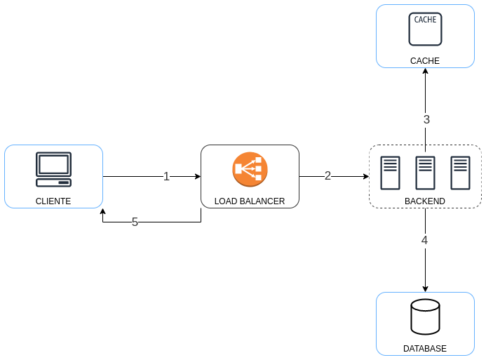

# Short url - Cloud PasS version


## System achitecture


### Backend
The backend application is running on the azure PasS service called 
App service.

https://azure.microsoft.com/en-us/products/app-service

This service is a managed service that allows to run a web application without the need to manage the underlying infrastructure, it have a lot of features like autoscaling, monitoring, backup, etc.

You only have to select a runtime or a docker setup and upload your code, 
using the azure cli config.

https://learn.microsoft.com/en-us/cli/azure/install-azure-cli

In this case we use the golang runtime.

### Database
We use the Mysql serverless service  Planet scale.

https://planetscale.com/

Like in the case of azure app service, this is a managed service that allows to run a mysql database without the need to manage the underlying infrastructure, automatic backups, autoscaling, etc.

It have a very interesting feature that allows to you to create a git like branch and merge to the production database, using database schema instead of code.

### Cache 
We use a azure service serverless called Azure cache for redis cache.

https://azure.microsoft.com/en-us/products/cache


## CI/CD
The project have a github actions configurations that runs two jobs define in this files.

**backend.yml**

This job runs on every commit, execute a static analysis check and tests.


**build-deploy.yml**
This job runs only when a new tag is created, it builds a docker image, push to docker hub and connect to a VM via ssh in order to run the lastest version of the service

---

## Setup local environment

Setup Mysql 

Go to the repo folder and run this command 
```bash
$ docker compose -f docker-compose-dev.yaml up -d mysql 
```

Create tables 
```bash
$ docker exec -i mysql-short-url mysql -uroot -p1111 < ./init.sql
```

Init redis

Run this command to init backend, redis and nginx on background
```bash
$ docker compose -f docker-compose-dev.yaml up -d redis 
```
Create .env file and set values
```bash
$ cp .env-example .env
```

Init kubernetes minkube 


Install instructions 

https://minikube.sigs.k8s.io/docs/start/


Start minikube
```bash
$ minikube start
```

Create alias for kubectl
```bash
$ alias kubectl="minikube kubectl --"
```

Create deployment, load balancer service 
```bash
$ k apply -f kubernetes/deployment.yaml
```

Get pods running 
```bash
$ k get pods
```

Tunnel to localhost
```bash
minikube tunnel
``` 

Get service IP
```bash
$ k get service
```

--- 
### Test endpoints

Create a short url
```bash
$ curl -X POST -H "Content-Type: application/json" -d '{"url":"http://site.com"}' http://localhost:8080/create-url
```

Get short url 
```bash
$ curl -X GET http://localhost:8080/hash-url
```
--- 

## Deploy to azure web services using azure cli
You need to install azure cli and login to your account before run this command.
```bash
$ ./scripts/deployAzure.sh
```


